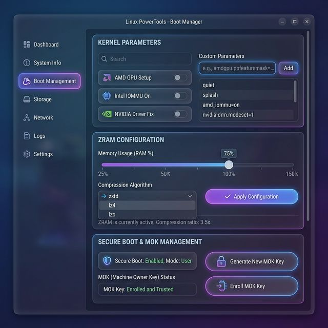

# Loofi Fedora Tweaks - User Guide 📖

> **Version 7.0.0 "Community Update"**  
> Complete documentation for all features and functionality.

---

## Table of Contents

1. [Quick Start](#quick-start)
2. [Dashboard](#dashboard)
3. [Boot Management](#boot-management)
4. [Marketplace & Drift Detection](#marketplace--drift-detection)
5. [CLI Reference](#cli-reference)
6. [All Tabs Overview](#all-tabs-overview)
7. [Troubleshooting](#troubleshooting)

---

## Quick Start

### Installation

```bash
# One-command install
curl -fsSL https://raw.githubusercontent.com/loofitheboss/loofi-fedora-tweaks/master/install.sh | bash
```

### Launch

```bash
# GUI Mode
loofi-fedora-tweaks

# CLI Mode
loofi info
loofi cleanup
```

---

## Dashboard


The **Dashboard** is your system health overview:

| Card | Description |
|------|-------------|
| **CPU Usage** | Current CPU utilization percentage |
| **Memory** | RAM usage (used/total) |
| **Disk Space** | Storage utilization |

### Quick Actions

| Button | Action |
|--------|--------|
| **Run Cleanup** | Clean DNF cache, vacuum journal, TRIM SSD |
| **Check Updates** | Check for system updates |
| **Apply Preset** | Apply your saved configuration preset |

---

## Boot Management



The **Boot** tab (v6.2+) provides three powerful sections:

### 1. Kernel Parameters

Manage kernel command line parameters with common presets:

| Preset | Parameters | Use Case |
|--------|------------|----------|
| **AMD GPU** | `amdgpu.ppfeaturemask=0xffffffff` | Enable AMD GPU overclocking |
| **Intel IOMMU** | `intel_iommu=on iommu=pt` | GPU passthrough for VMs |
| **NVIDIA** | `nvidia-drm.modeset=1` | Enable NVIDIA modesetting |

**Custom Parameters**: Add any kernel parameter manually.

> ⚠️ **Backup**: The tool automatically backs up GRUB config before changes.

### 2. ZRAM Configuration

Compressed swap in RAM for better performance:

| Setting | Range | Recommendation |
|---------|-------|----------------|
| **Size** | 25-150% RAM | 50-100% for most users |
| **Algorithm** | zstd, lz4, lzo | `zstd` (best compression) |

### 3. Secure Boot & MOK

Manage Machine Owner Keys for third-party kernel modules:

1. **Generate Key**: Creates RSA 2048-bit key pair
2. **Enroll Key**: Imports key to MOK list
3. **Reboot**: Press any key in MOK Manager, enter password

---

## Marketplace & Drift Detection


### Community Marketplace (v7.0+)

Browse and download presets created by the community:

1. **Search**: Find presets by name or description
2. **Filter**: Categories (Gaming, Privacy, Performance, etc.)
3. **Details**: View stars, downloads, and description
4. **Download**: Save preset locally
5. **Apply**: Apply preset and set drift baseline

### Configuration Drift Detection

Monitor when your system diverges from applied presets:

| State | Meaning |
|-------|---------|
| **No Baseline** | No preset has been applied with tracking |
| **Stable** | System matches the baseline |
| **Drifted** | Changes detected (packages, services, kernel) |

**What is tracked:**

- Kernel command line parameters
- Installed/layered packages
- User-enabled systemd services

---

## CLI Reference

### Basic Commands

```bash
# System information
loofi info

# Full cleanup (DNF + journal + trim)
loofi cleanup

# Cleanup specific action
loofi cleanup dnf
loofi cleanup journal --days 7
loofi cleanup trim
```

### Power Management

```bash
# Set power profile
loofi tweak power --profile performance
loofi tweak power --profile balanced
loofi tweak power --profile power-saver

# Check current status
loofi tweak status

# Restart audio
loofi tweak audio

# Set battery limit (HP Elitebook)
loofi tweak battery --limit 80
```

### Advanced Operations

```bash
# Apply DNF optimizations
loofi advanced dnf-tweaks

# Enable TCP BBR
loofi advanced bbr

# Install GameMode
loofi advanced gamemode

# Set swappiness
loofi advanced swappiness --value 10
```

### Network

```bash
# Set DNS provider
loofi network dns --provider cloudflare
loofi network dns --provider google
loofi network dns --provider quad9
```

---

## All Tabs Overview

| Tab | Icon | Description |
|-----|------|-------------|
| **Home** | 🏠 | Dashboard with system health and quick actions |
| **System Info** | ℹ️ | Hardware specs, OS version, kernel info |
| **Updates** | 📦 | Check and install system updates |
| **Cleanup** | 🧹 | DNF cache, orphans, journal vacuum |
| **Hardware** | ⚡ | CPU governor, power profiles, GPU mode |
| **HP Tweaks** | 💻 | Battery limit, fingerprint (HP specific) |
| **Apps** | 🚀 | One-click installation of popular apps |
| **Advanced** | ⚙️ | DNF optimization, TCP BBR, GameMode |
| **Gaming** | 🎮 | MangoHud, ProtonUp, Game Mode |
| **Network** | 🌐 | DNS, firewall, MAC address |
| **Presets** | 💾 | Save/load/sync configurations |
| **Marketplace** | 🌐 | Community presets + drift detection |
| **Scheduler** | ⏰ | Automated tasks and triggers |
| **Boot** | 🔧 | Kernel params, ZRAM, Secure Boot |
| **Repos** | 📁 | Repository management |
| **Privacy** | 🔒 | Telemetry and privacy settings |
| **Theming** | 🎨 | GTK/Qt theme configuration |
| **Overlays** | 📦 | rpm-ostree packages (Atomic only) |

---

## Troubleshooting

### App Won't Launch

```bash
# Check dependencies
pip install PyQt6

# Run from source
cd loofi-fedora-tweaks/loofi-fedora-tweaks
python3 main.py
```

### Permission Denied

Most operations require root. The app uses `pkexec` for privilege escalation.

```bash
# Ensure polkit is installed
sudo dnf install polkit
```

### DNF Lock Error

Another package manager is running:

```bash
# Wait for it to finish, or:
sudo rm /var/run/dnf.pid
```

### Secure Boot Key Not Enrolling

1. Reboot after `mokutil --import`
2. In MOK Manager, select **Enroll MOK**
3. Enter the password you set
4. Continue boot

### Marketplace Not Loading

Check internet connection:

```bash
curl -I https://raw.githubusercontent.com
```

---

## Support

- **Issues**: [GitHub Issues](https://github.com/loofitheboss/loofi-fedora-tweaks/issues)
- **Releases**: [GitHub Releases](https://github.com/loofitheboss/loofi-fedora-tweaks/releases)

---

*Documentation last updated: v7.0.0 - February 2026*
