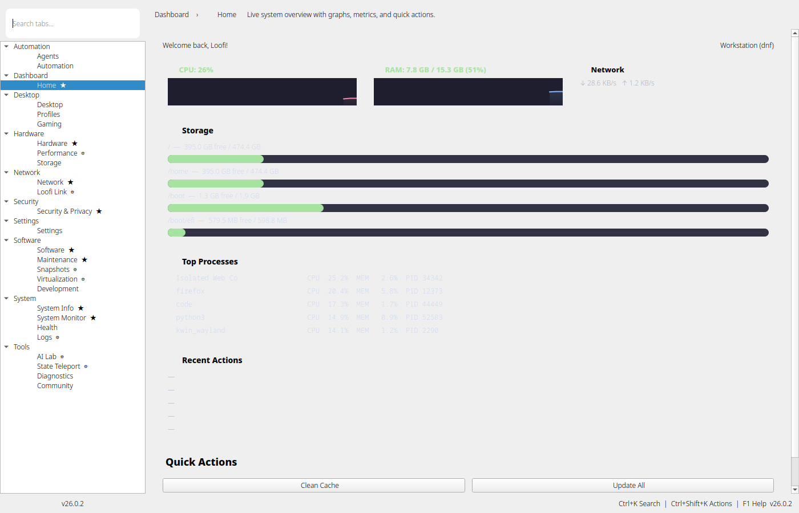
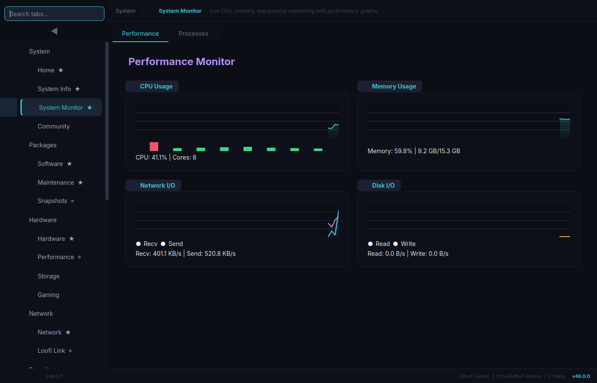
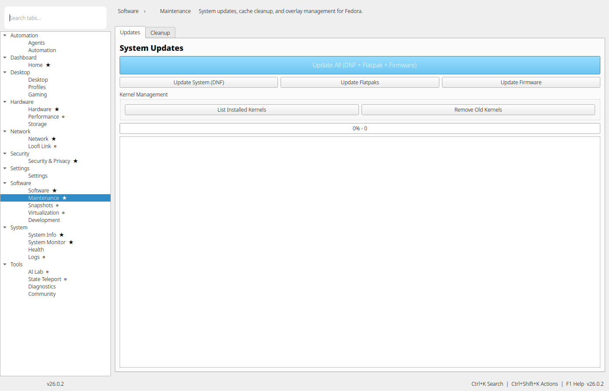
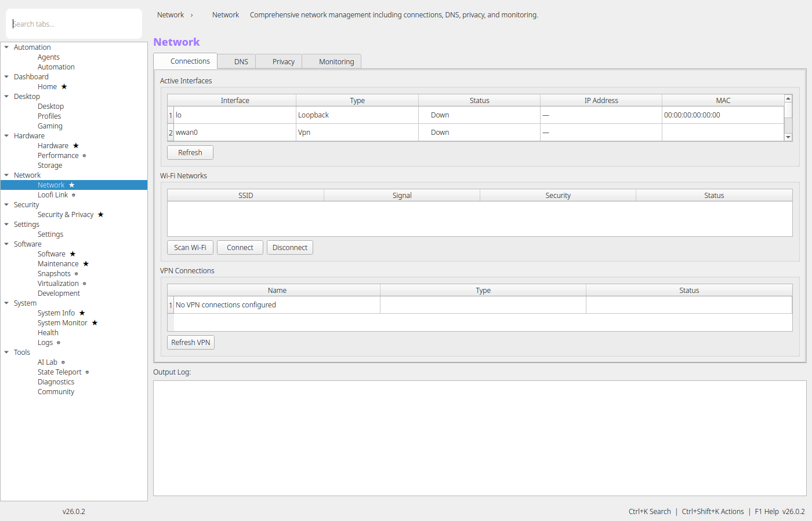
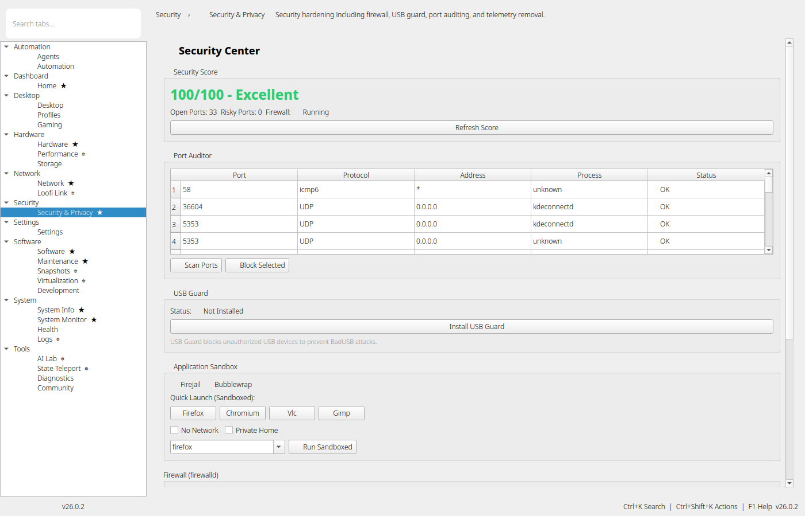
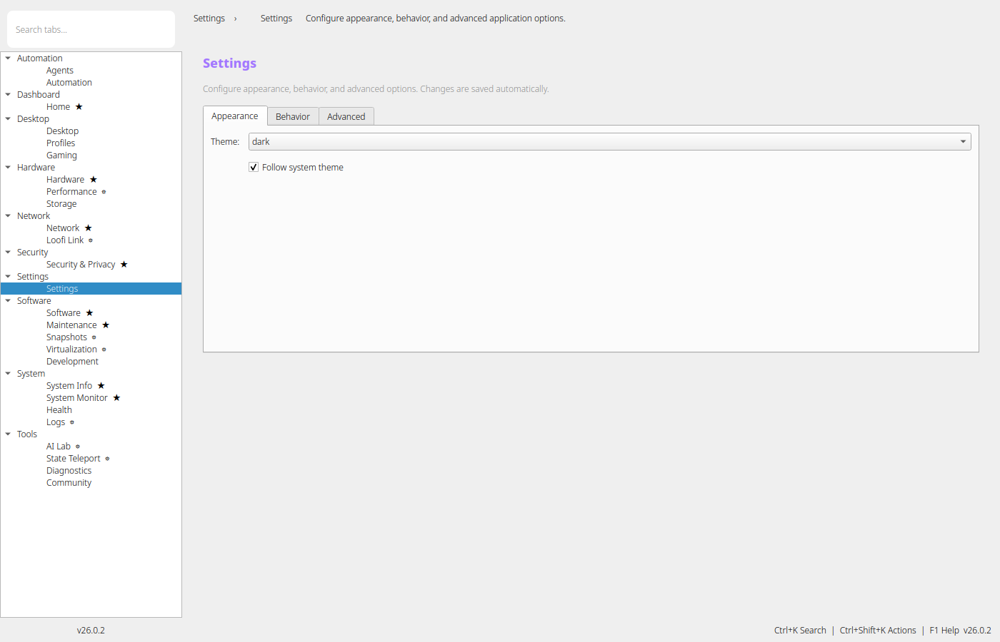
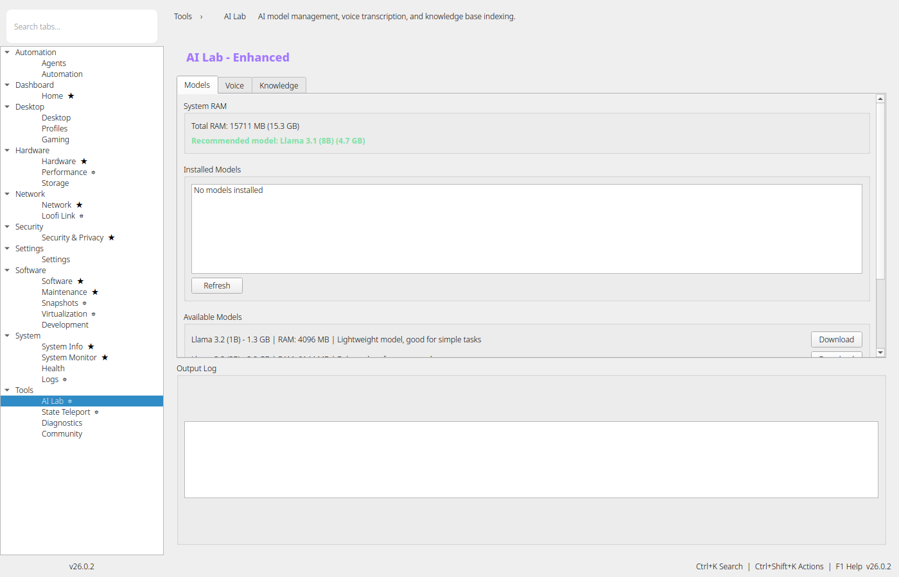
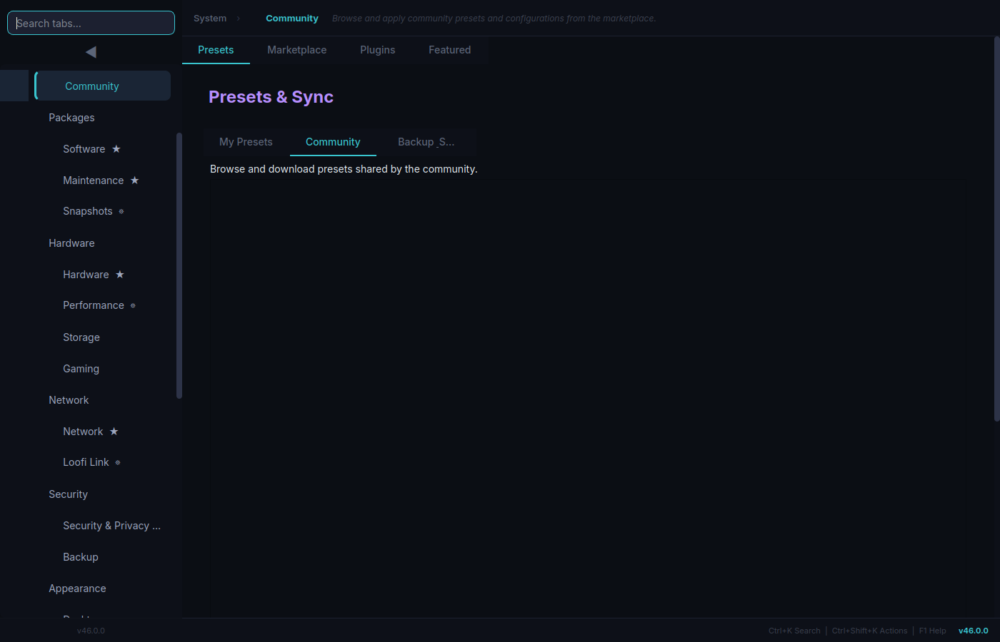
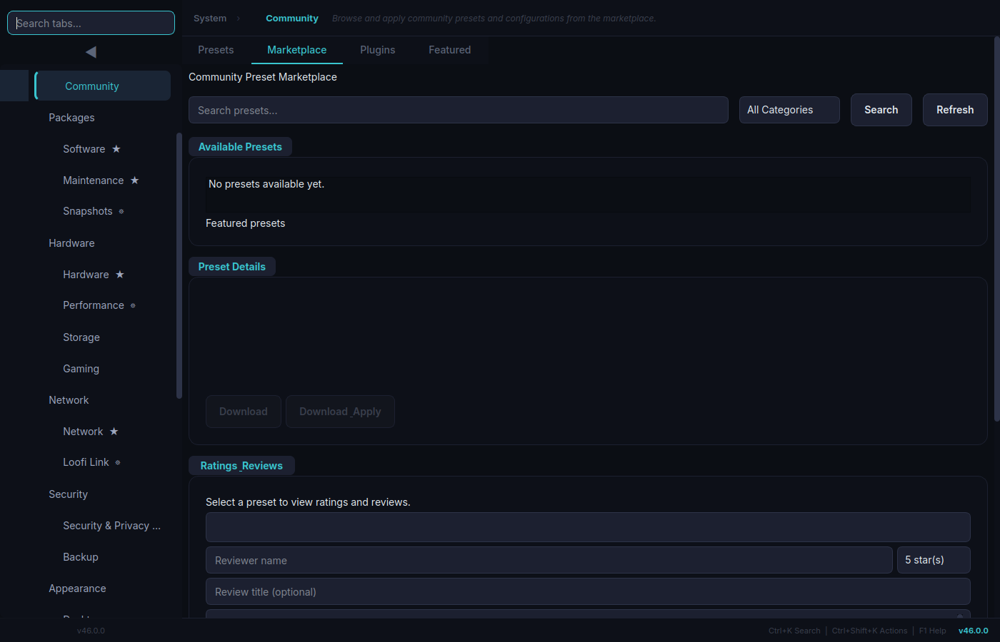

# Loofi Fedora Tweaks — User Guide

> Version 33.0.0 "Bastion"

This guide covers daily use of Loofi Fedora Tweaks in GUI and CLI mode.

For quick onboarding use `docs/BEGINNER_QUICK_GUIDE.md`.
For admin workflows use `docs/ADVANCED_ADMIN_GUIDE.md`.

---

## 1) What Loofi Does

Loofi Fedora Tweaks is a Fedora control center with three entry modes:

- GUI (`loofi-fedora-tweaks`)
- CLI (`loofi-fedora-tweaks --cli ...`)
- Daemon (`loofi-fedora-tweaks --daemon`)

Core behavior:

- Plugin-based tabs loaded via registry and lazy widgets
- Privileged actions executed with `pkexec` (never `sudo`)
- Automatic Fedora mode detection (`dnf` vs `rpm-ostree`)
- Safety confirmations for dangerous operations

---

## 2) Install and Launch

Install:

```bash
curl -fsSL https://raw.githubusercontent.com/loofitheboss/loofi-fedora-tweaks/master/install.sh | bash
```

Launch:

```bash
loofi-fedora-tweaks
```

Optional CLI alias:

```bash
alias loofi='loofi-fedora-tweaks --cli'
```

---

## 3) UI Layout and Navigation

Main areas:

- Sidebar: categories and tabs
- Header area: tab title and context
- Main pane: active tools
- Bottom status area: app state and shortcuts

Primary shortcuts:

- `Ctrl+K` command palette
- `Ctrl+Shift+K` quick actions
- `Ctrl+Tab` / `Ctrl+Shift+Tab` next/previous tab
- `F1` shortcuts help
- `Ctrl+Q` quit

Current category model:

- Overview
- Manage
- Hardware
- Network & Security
- Personalize
- Developer
- Automation
- Health & Logs



---

## 4) Recommended Workflows

### Daily (2–3 minutes)

1. Check **Overview → Home** for health and activity.
2. Check **Overview → System Monitor** for abnormal CPU/RAM/process usage.
3. Check **Network & Security → Security & Privacy** if score dropped or alerts appear.



### Weekly Maintenance

1. Run updates from **Manage → Maintenance → Updates**.
2. Run cleanup actions from **Manage → Maintenance → Cleanup**.
3. Validate security score and firewall status.
4. Refresh snapshots before risky changes.



### Before Risky Changes

1. Create a snapshot.
2. Export profile(s).
3. Create support bundle if troubleshooting baseline is needed:

```bash
loofi support-bundle
```

---

## 5) Tabs by Category

## Overview

- **Home**: health score, quick status, fast navigation
- **System Info**: OS/kernel/hardware/system metadata
- **System Monitor**: performance and process analysis

## Manage

- **Software**: applications and repositories
- **Maintenance**: updates, cleanup, overlays on Atomic systems
- **Snapshots**: create/delete/refresh snapshot timeline
- **Storage**: disk usage, SMART, TRIM, filesystem checks

## Hardware

- **Hardware**: power/governor/fan/audio/Bluetooth helper controls
- **Performance**: workload-based tuning recommendation/apply flow
- **Gaming**: gaming-focused optimization shortcuts

## Network & Security

- **Network**: connections, DNS, privacy, monitoring
- **Loofi Link**: local peer discovery, clipboard, file drop
- **Security & Privacy**: score, firewall, telemetry, hardening actions





## Personalize

- **Desktop**: desktop/theming controls
- **Profiles**: save/apply/import/export profile states
- **Settings**: appearance, behavior, advanced options



## Developer

- **Development**: container/developer utilities
- **AI Lab**: models, voice, and knowledge indexing
- **Diagnostics**: service/system checks and support actions
- **Virtualization**: VM operations, passthrough checks, disposable flows



## Automation

- **Agents**: local agent dashboard and controls
- **Automation**: scheduler and replicator workflows
- **Community**: presets and marketplace actions
- **State Teleport**: capture/restore workspace state packages





## Health & Logs

- **Health**: historical health timeline/trends
- **Logs**: filtered log inspection and export tools

---

## 6) CLI by Task

System and diagnostics:

```bash
loofi info
loofi health
loofi doctor
loofi support-bundle
```

Maintenance:

```bash
loofi cleanup all
loofi cleanup journal --days 7
loofi tuner analyze
loofi tuner apply
```

Services/packages/logs:

```bash
loofi service list --filter failed
loofi service restart sshd
loofi package search --query firefox --source all
loofi logs errors --since "2h ago"
```

Security/network/storage:

```bash
loofi security-audit
loofi firewall status
loofi network dns --provider cloudflare
loofi storage usage
```

Automation and advanced:

```bash
loofi agent list
loofi vm list
loofi vfio check
loofi mesh discover
loofi teleport capture --path ~/workspace --target laptop
```

Machine-readable output:

```bash
loofi --json info
loofi --json health
```

---

## 7) Data Locations

- `~/.config/loofi-fedora-tweaks/settings.json`
- `~/.config/loofi-fedora-tweaks/profile.json`
- `~/.config/loofi-fedora-tweaks/first_run_complete`
- `~/.local/share/loofi-fedora-tweaks/startup.log`

---

## 8) Troubleshooting and Support

First-line diagnostics:

```bash
loofi doctor
loofi info
loofi support-bundle
```

Then review `docs/TROUBLESHOOTING.md`.

If opening an issue, include:

1. Fedora version and desktop environment
2. Exact tab/action or command
3. Full error output
4. Reproduction steps
5. Support bundle path

Issue tracker: <https://github.com/loofitheboss/loofi-fedora-tweaks/issues>

---

## 9) Screenshot Catalog

All current user-guide screenshots are tracked in:

- `docs/images/user-guide/README.md`
