# Epic Architecture Specification — v46.0 "Navigator"

> **Epic**: Navigation Clarity & Release Alignment
> **Version**: 46.0.0 | **Codename**: Navigator
> **Status**: ACTIVE
> **Author**: AI Architect | **Date**: 2026-02-17

---

## 1. Epic Architecture Overview

v46.0 "Navigator" is a **zero-runtime-change** release focused on reorganizing the tab
category taxonomy and aligning navigation metadata across the entire application surface.
The architectural impact is confined to plugin metadata, sidebar rendering, command palette
labels, and release artifact versioning. No new modules, services, or system integrations
are introduced.

**Technical approach**: Modify `PluginMetadata.category` values across all 28 tab modules
to conform to a canonical 8-category taxonomy, update the `MainWindow` sidebar renderer
and `CommandPalette` category filter to use the new labels, then cascade the version bump
through the standard three-file version sync pipeline.

Key architectural constraint: all changes are **data-level** (metadata strings, version
constants, category enums) — no control flow, subprocess, or privilege escalation changes.

---

## 2. System Architecture Diagram

```mermaid
graph TB
    subgraph "User Layer"
        USER["👤 Desktop User"]
    end

    subgraph "Application Layer"
        MAIN["main.py<br/>(GUI Entry Point)"]
        MW["MainWindow<br/>(Sidebar + Tab Stack)"]
        CP["CommandPalette<br/>(Ctrl+K Search)"]
    end

    subgraph "Plugin / Metadata Layer"
        style PM fill:#e8f4fd,stroke:#4a90d9
        PL["PluginLoader<br/>(core/plugins/loader.py)"]
        PR["PluginRegistry<br/>(core/plugins/registry.py)"]
        PM["PluginMetadata<br/>(category, order, icon)"]
        TABS["28 Tab Modules<br/>(ui/*_tab.py)"]
    end

    subgraph "Category Taxonomy (v46 Change Surface)"
        style CAT fill:#fff3cd,stroke:#d4a017
        CAT["8 Canonical Categories<br/>System │ Packages │ Hardware │ Network<br/>Security │ Appearance │ Tools │ Maintenance"]
    end

    subgraph "Icon System"
        IP["icon_pack.py<br/>(Semantic ID → QIcon)"]
        ICONS["assets/icons/<br/>(SVG + PNG)"]
    end

    subgraph "Version Sync Pipeline"
        style VS fill:#d4edda,stroke:#28a745
        VP["version.py"]
        SPEC["loofi-fedora-tweaks.spec"]
        TOML["pyproject.toml"]
        BUMP["scripts/bump_version.py"]
    end

    USER --> MAIN
    MAIN --> MW
    MW --> CP
    MW --> PL
    PL --> PR
    PR --> PM
    PM --> TABS
    PM --> CAT
    MW -->|"sidebar icons"| IP
    IP --> ICONS
    BUMP --> VP
    BUMP --> SPEC
    BUMP --> TOML
```

---

## 3. High-Level Features & Technical Enablers

### Features

| # | Feature | Description |
|---|---------|-------------|
| F1 | **Category Taxonomy Reorganization** | Reclassify all 28 tabs into 8 canonical categories (`System`, `Packages`, `Hardware`, `Network`, `Security`, `Appearance`, `Tools`, `Maintenance`) by updating `PluginMetadata.category` in each `*_tab.py` module |
| F2 | **Sidebar Category Alignment** | Ensure `MainWindow` sidebar section headers and ordering match the new taxonomy |
| F3 | **Command Palette Category Labels** | Update `CommandPalette` category filter labels to use the new taxonomy names |
| F4 | **Plugin Metadata Order Consistency** | Normalize `PluginMetadata.order` values so tabs appear in a logical sequence within each category |
| F5 | **Version & Release Artifact Alignment** | Bump version to 46.0.0 across `version.py`, `pyproject.toml`, `.spec`; update changelog and release notes |

### Technical Enablers

| # | Enabler | Description |
|---|---------|-------------|
| E1 | **Category Constants** | Define canonical category strings in `ARCHITECTURE.md` sidebar table (already done) — no new code constants needed since categories are string literals in metadata |
| E2 | **Test Coverage for Categories** | Update/add tests that validate all tabs have a valid category from the canonical set |
| E3 | **bump_version.py** | Existing script handles the three-file version cascade — no changes needed |

---

## 4. Technology Stack

| Component | Technology | Role in this Epic |
|-----------|-----------|-------------------|
| **Language** | Python 3.12+ | All source modules |
| **UI Framework** | PyQt6 | Sidebar rendering, tab stack, command palette |
| **Plugin System** | `core/plugins/` (PluginMetadata, PluginLoader, PluginRegistry) | Category and order metadata propagation |
| **Icon System** | `ui/icon_pack.py` + `assets/icons/` | Sidebar category icons (semantic IDs) |
| **Testing** | unittest + unittest.mock | Category validation tests |
| **Linting** | flake8 (max-line-length=150) | Code quality gate |
| **Type Checking** | mypy | Type safety gate |
| **CI** | GitHub Actions (ci.yml) | lint + typecheck + pytest + coverage |
| **Packaging** | RPM (.spec), pyproject.toml | Version alignment |

---

## 5. Technical Value

**Value: Medium**

- **Low risk**: All changes are metadata-level string updates — no behavioral changes to subprocess calls, privilege escalation, or system integration
- **High discoverability impact**: Users benefit from a clearer, more consistent sidebar that groups related tabs logically
- **Maintenance benefit**: A canonical category taxonomy simplifies future tab additions — new tabs slot into a well-defined category instead of ad hoc placement
- **No new dependencies or infrastructure** required

---

## 6. T-Shirt Size Estimate

**Size: S (Small)**

Justification:
- 28 tab files need a one-line `category=` change each (mechanical)
- `MainWindow` sidebar and `CommandPalette` category labels are string-driven — minimal code change
- Version bump is scripted (`bump_version.py`)
- Test updates are straightforward assertions on metadata values
- No new modules, services, APIs, or system interactions
- Total estimated scope: ~30–40 files touched, all with small, repetitive changes
