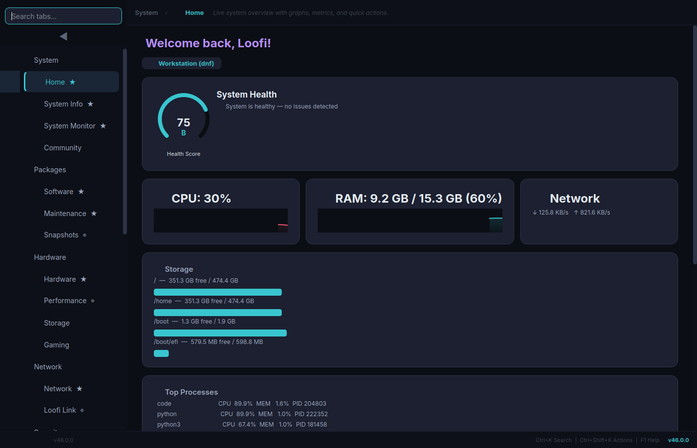
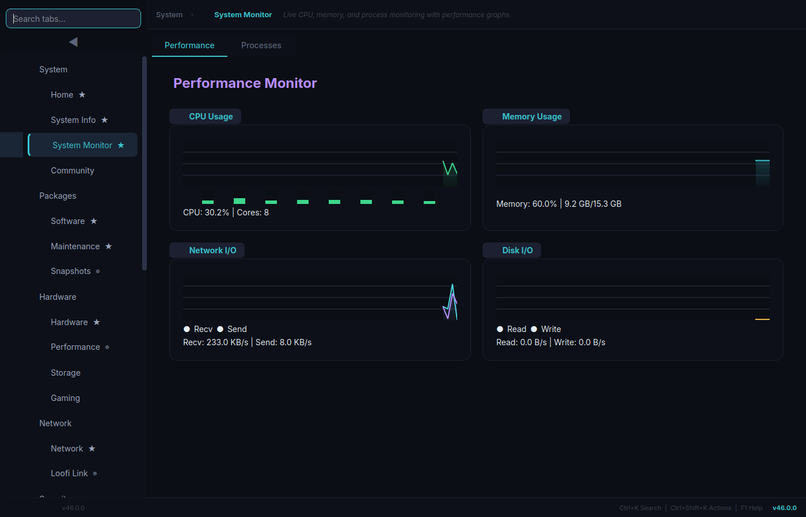
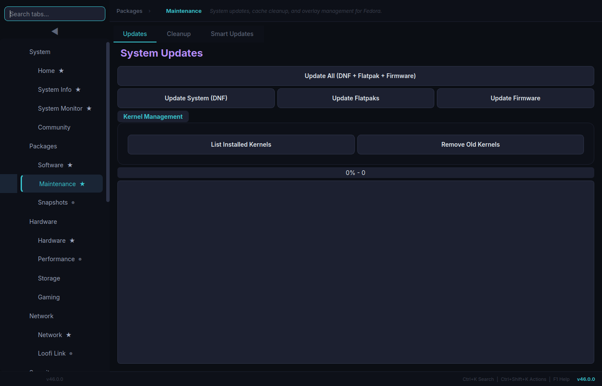
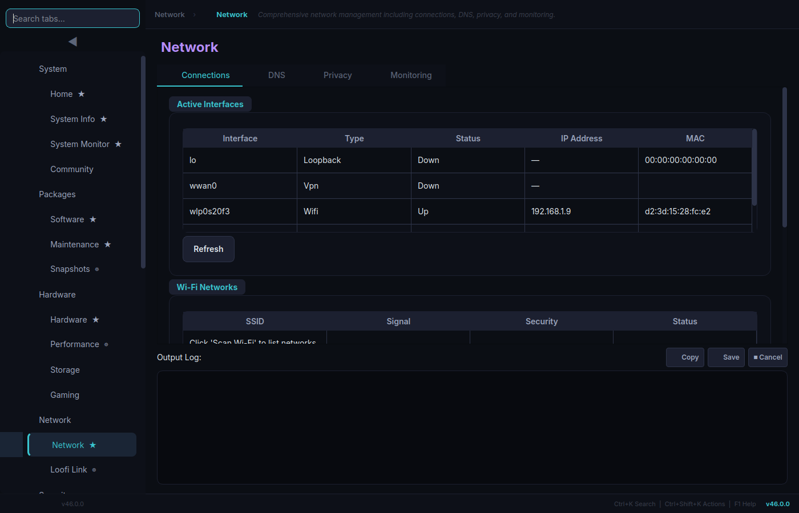
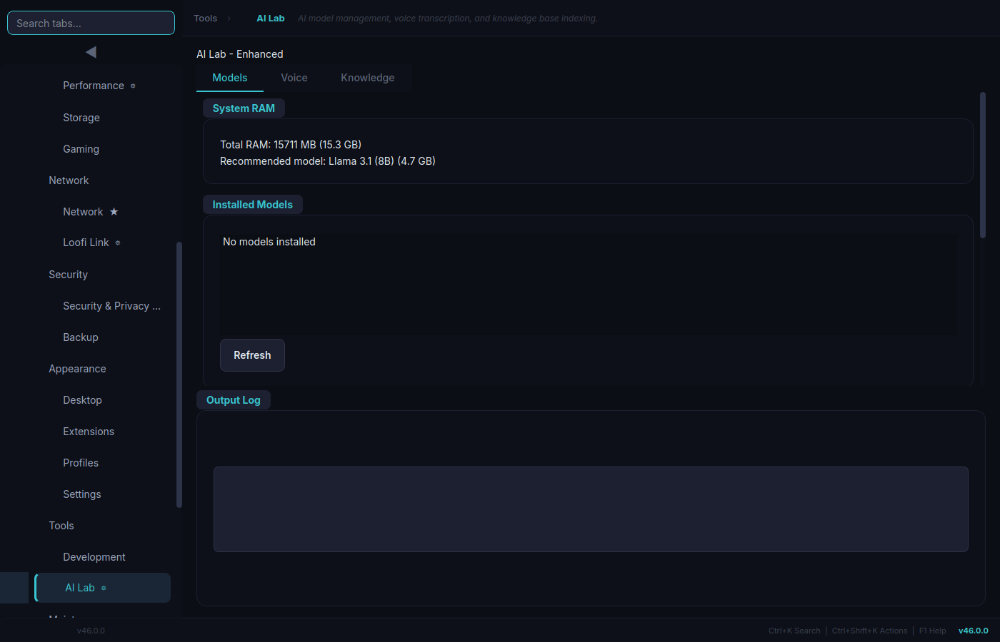
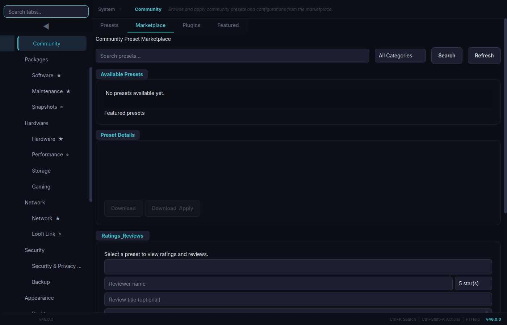
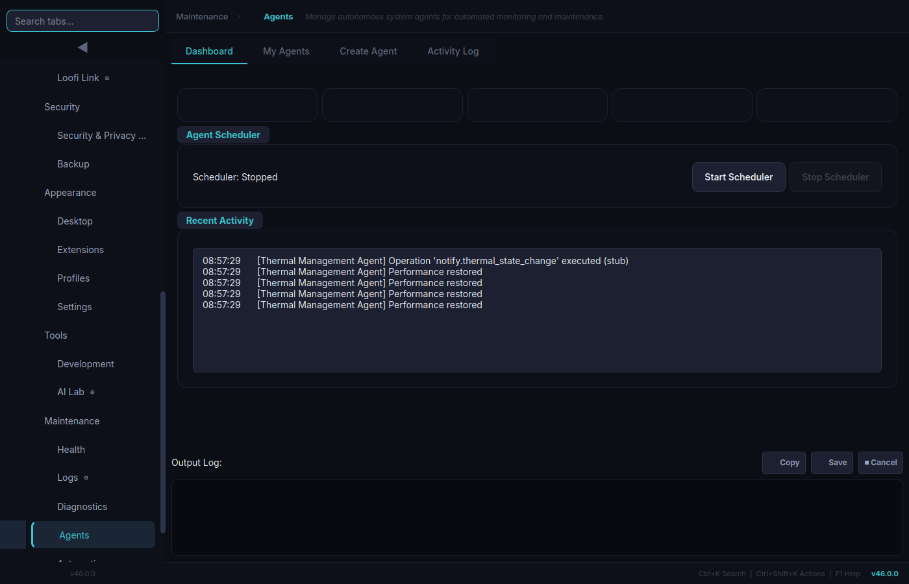
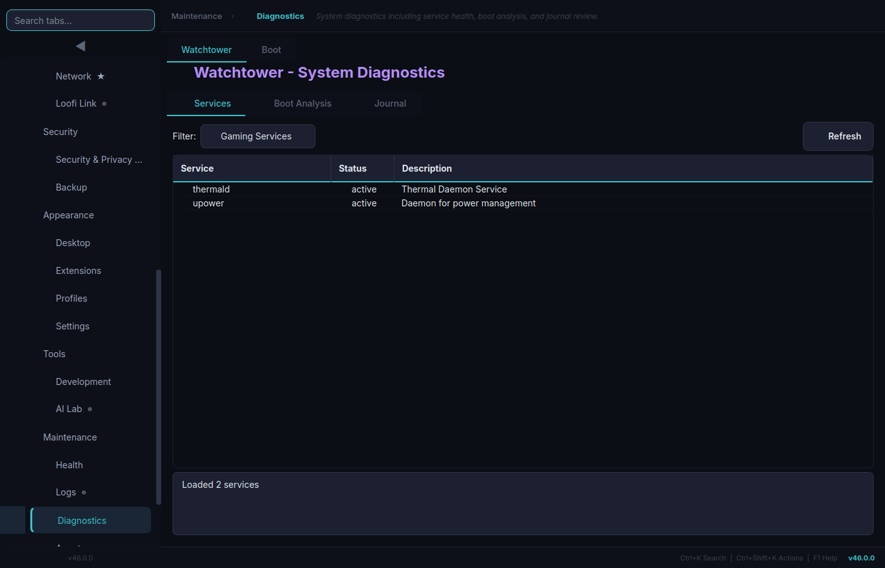

# Loofi Fedora Tweaks Wiki

Welcome to the official wiki for **Loofi Fedora Tweaks** — a modern Fedora control center for maintenance, diagnostics, security, performance, and automation.

**Current Version**: v46.0.0 "Navigator"  
**Screenshots Refreshed**: February 17, 2026

## At a Glance

- 28 feature tabs across system, packages, hardware, network, security, and automation
- 4 run modes: GUI, CLI (`--json`), daemon scheduler, and Web API
- Plugin architecture with marketplace support
- Atomic-aware behavior (`dnf` vs `rpm-ostree`)
- Privileged actions through `pkexec` (never `sudo`)

## Start Here

- [Installation](Installation)
- [Getting Started](Getting-Started)
- [GUI Tabs Reference](GUI-Tabs-Reference)
- [CLI Reference](CLI-Reference)
- [Screenshots](Screenshots)

## Feature Preview

### Core Workflows

### Advanced Workflows

## Wiki Pages

### Getting Started

- [Installation](Installation)
- [Getting Started](Getting-Started)
- [FAQ](FAQ)

### Features and Usage

- [GUI Tabs Reference](GUI-Tabs-Reference)
- [CLI Reference](CLI-Reference)
- [Configuration](Configuration)
- [Screenshots](Screenshots)

### Architecture and Development

- [Architecture](Architecture)
- [Plugin Development](Plugin-Development)
- [Security Model](Security-Model)
- [Atomic Fedora Support](Atomic-Fedora-Support)

### Contributing and Support

- [Contributing](Contributing)
- [Testing](Testing)
- [CI/CD Pipeline](CI-CD-Pipeline)
- [Troubleshooting](Troubleshooting)

### Reference

- [Changelog](Changelog)

## Quick Links

- GitHub Repository: [loofitheboss/loofi-fedora-tweaks](https://github.com/loofitheboss/loofi-fedora-tweaks)
- Latest Release: [v46.0.0](https://github.com/loofitheboss/loofi-fedora-tweaks/releases/tag/v46.0.0)
- Issues: [Issue Tracker](https://github.com/loofitheboss/loofi-fedora-tweaks/issues)
- Main README: [README.md](https://github.com/loofitheboss/loofi-fedora-tweaks/blob/master/README.md)
- Architecture Doc: [ARCHITECTURE.md](https://github.com/loofitheboss/loofi-fedora-tweaks/blob/master/ARCHITECTURE.md)

## Support

1. Check [Troubleshooting](Troubleshooting).
2. Search existing [GitHub Issues](https://github.com/loofitheboss/loofi-fedora-tweaks/issues).
3. Run `loofi-fedora-tweaks --cli doctor` and `loofi-fedora-tweaks --cli support-bundle`.
4. Open a new issue with Fedora version, desktop environment, repro steps, and logs.
